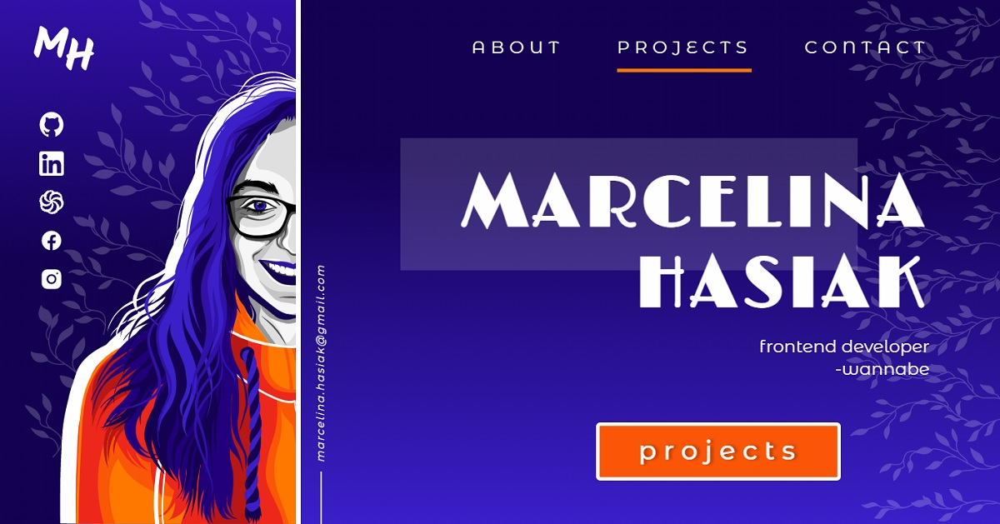

# PORTFOLIO
This website had to assemble all my all previous project in one place, so it does. 

## Development state
The code is rather simple. It contains rather semantic HTML and styles written in SASS.
I used Vanilla JavaScript without any library to handle navigation bar / hamburger menu and animations during scrolling the website, but for the carousel I used Glide.js.
The form is handled by netlify.

## How to use it?
- Clone the repository
- Install all necessary packages by `npm install`

## Available scripts
`npm run start` - runs development mode

`npm run build` - runs build process for production

`npm run publish` - runs build process and publish the page using `gh-pages` branch

## Author
Marcelina Hasiak - Design, svg graphics and coding
Webpack Starter Kit - [here](https://github.com/maciejkorsan/wtf-webpack-starter)

## License
For personal use only. Do not distribute.

